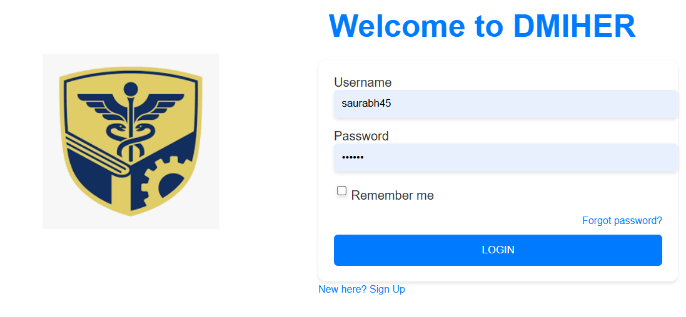

# College Web Application

This repository is part of my project where i have created a web based college application, where all the colleges within the university can visit it. It is designed such that one can access the subjects interested from the other department. Also here students can post their research publications. The regular event updates will be displayed. Regular syllabus alongwith library equipments are also employed into it.

## Table of Contents
- [Introduction](#introduction)
- [Project Workflow](#project-workflow)
- [Features](#features)
- [Installation](#installation)
- [Result](#result)
- [Benefits](#benefits)
- [Contributing](#contributing)
- [License](#license)

## Introduction
This web-based application is designed to provide a comprehensive transdisciplinary education platform. It features a user-friendly interface with essential functionalities such as login, signup, and password recovery. After logging in, users can access various sections, including college details, update profile, library resources, event details, upload research papers, serach subjects by their name, etc. The application ensures a seamless and intuitive experience, facilitating easy navigation and access to educational materials and support.
### Login Page


## Project Workflow
The overall workflow of the project is as follows:

1. User accesses the login page.
2. User enters credentials and logs in.
3. Application verifies the login credentials.
4. Upon successful login, the user is redirected to the homepage.
5. The homepage displays list of colleges and other information.
6. User navigates to different colleges through the college navigation bar and can can gaet many more features like:
    - **Course Details**
    - **Research Papers**
    - **Learning Materials**
    - **Settings**
    - **Profile Page**
    - **Logout Option**
8. Each section provides specific functionalities.

## Features
### User Authentication
- Secure login and signup functionality.
- Password recovery for forgotten passwords.

### Homepage
- Displays list of colleges and personalized user information.

### Navigation Bar
- Easy access to various sections including:
  - **College Details**: View and access college courses, activities and learning materials
  - **Library Resources**: Access a wide range of educational resources.
  - **Research Papers**: Browse or upload research papers.
  - **Profile Page**: View and update user profile information.
  - **Logout**: Securely end the session and redirect to the login page.

### Responsive Design
- Fully responsive interface that works seamlessly on desktop and mobile devices.

### Interactive Elements
- User-friendly interface with hover effects and interactive buttons for a better user experience.

### Secure Data Handling
- All user data is securely stored and managed using modern web technologies.

### Profile Management
- Users can view and edit their profiles to keep their information up-to-date.

### Resource Access
- Users can easily access and utilize various learning materials and resources.

### Activity Notifications
- Allows users to participate in various events organized.

### Research Papers
- Users can browse as well as uplpoad their own papers.

### Session Management
- Ensures secure session handling with proper login/logout mechanisms.

## Installation
1. Clone the repository:
   ```bash
   git clone https://github.com/College-Web-Application.git
   ```
2. Navigate to the project directory:
   ```bash
   cd project-directory
   ```
3. Install dependencies:
   ```bash
   npm install
   ```
4. Start the development server:
   ```bash
   npm start
   ```
5. Open your browser and navigate to `http://localhost:3000`.

## Result
Our e-learning application delivers a comprehensive and user-friendly platform for both students and educators. Key results include:

- **Enhanced Learning Experience**: Access to a wide range of online resources and materials that enhance the learning journey.
- **Seamless Navigation**: Intuitive navigation ensures users can easily access all sections and features of the application.
- **Efficient Profile Management**: Effortless management and updating of user profiles.
- **Improved Interaction**: Students can connect with various required features or also can upload their doubts for personalized guidance and support.
- **Easy Application Process**: A streamlined process for applying to tuition services.
- **Secure and Reliable**: User data is securely handled with modern technologies.
- **Responsive Design**: An optimal user experience across various devices, including desktops, tablets, and smartphones.

## Benefits
- **User-Friendly**: Intuitive design for easy navigation and usage.
- **Comprehensive Resources**: Access to a wide range of educational materials.
- **Transdisciplinary Course Access**: Browse all the interested resources.
- **Responsive Design**: Seamless experience across all devices.
- **Secure**: Robust security measures to protect user data.
- **Efficient Management**: Easy profile and application management.

## Contributing
We welcome contributions! To contribute:

1. Fork the repository.
2. Create a new branch:
   ```bash
   git checkout -b feature-branch
   ```
3. Make your changes.
4. Commit your changes:
   ```bash
   git commit -m 'Add new feature'
   ```
5. Push to the branch:
   ```bash
   git push origin feature-branch
   ```
6. Open a pull request.

Thank you for your contributions!

## License
This project is licensed under the [MIT License](LICENSE).

